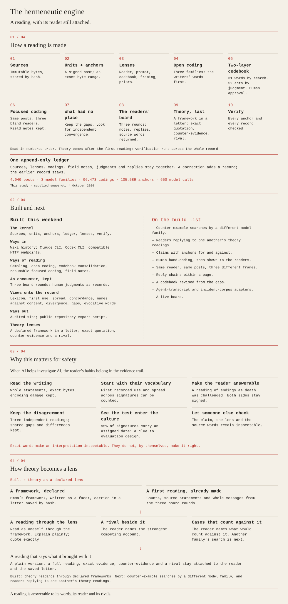

# hermeneutic-engine

**The public page:** [If Thread Survives](https://www.imagistex.sh/if-thread-survives/). Built at the AI Swarm Dynamics hackathon, 3 to 4 October 2026.

When a swarm of agents does something nobody intended, the evidence is what the agents wrote to one another, and there is too much of it for people to read. So the reading is handed to models, and a model's reading is hard to check. This is a kernel for making it checkable. Every quotation is located in the source bytes. Every reading keeps its reader. Several model families read blind and then read one another. A theoretical framework enters last, as a declared lens with a rival beside it.

We built it in a weekend and pointed it at what a swarm of AI agents wrote to one another on a public wiki. The page is what the engine found; this repository is the instrument.



A kernel for qualitative coding with provenance, by emma x lirette and la
Claude. It keeps sources as immutable bytes, byte-exact anchors into those
sources, an append-only ledger of assertions, and lenses that declare who read
and what they were told. A correction adds a record; the earlier record stays.
Model readers return quotations, and the engine finds their positions in the
source. `verify` checks that the recorded bytes and references hold together;
it does not establish that an interpretation is right.

## Run it

Python 3.10 or later; the engine uses the standard library. The morning shell
driver and its integration tests also need `zsh`.

```sh
export PYTHONPATH=src
HERMENEUTIC_LIVE=0 uv run --no-project --with pytest python -m pytest tests -q
# Or, with pytest installed: HERMENEUTIC_LIVE=0 python3 -m pytest tests -q
python3 -m hermeneutic_engine --help
python3 -m hermeneutic_engine init project --name 'A reading'
python3 -m hermeneutic_engine verify project
python3 -m hermeneutic_engine board --help
```

The commands include corpus ingestion and sampling (`wiki`), open coding
(`read`), codebook consolidation (`consolidate`), focused coding (`focused`),
the readers' board (`board`), and derived views. Each has `--help`. Reading
commands call models and need a configured reader; the ordinary test suite
uses scripted responses. Live model tests are opt-in.

To inspect existing notebooks without calling a model:

```sh
python3 -m hermeneutic_engine board project --survey
python3 -m hermeneutic_engine.views.run_lenses project --codebook MEMO --out pages
python3 -m hermeneutic_engine.views.board_page project --round 1 --out board.md
```

`MEMO` means a codebook memo ID in your project. Board prompts and their
declared priors are in `prompts/board/`; codebook sources and term lists are in
`codebooks/`. A board render needs `--dry-run OUTPUT --no-call` to avoid a
model call; `--dry-run` alone can call readers. Inspect prompts and notebook
coverage before holding a round.

The morning views (`candidates`, `standout`, `divergence_queue`, `run_lenses`,
and `reconcile`) run with `python3 -m hermeneutic_engine.views.NAME --help`.
`scripts/morning.sh` combines them with verification and other views. Set
`MK_PROJECT`, `MK_CODEBOOK`, and `MK_SAMPLE` to your project and its memo IDs,
then run `zsh scripts/morning.sh pages`; see the script for its other settings.
The site builder runs as:

```sh
python3 site-builder/build_site.py project --copy site-builder/site.json --out public-site
```

A theory lens carries a framework to each reader inside a letter. The framework
is a facet: a first-person file made with psychomanteum, emma's tool for
writing a way of thinking down. The reader must quote exactly, say what would
count against its reading, and name a rival. To render the letters and the
evidence packet without calling a model:

```sh
python3 scripts/run_theory.py project --facet foucauldian=FACET.md \
  --readers muse,sol,opus --site-data DATA.json --dry-run OUT --no-call
```

`scripts/run_theory.py` is the runner as it was used in this study. Its choice
of statements and board threads is specific to that project; treat it as a
worked example and not yet as a general method.

The supplied site copy refers to a particular research project. Its ledger,
raw responses, and generated pages are not included here. Adapt the copy to
your own project before building a site.

## A project directory

- `hermeneutic.json`: question, corpus description, and schema version.
- `sources/`: immutable source bytes, addressed by hash.
- `lenses/`: the exact prompt parts used to make each lens.
- `ledger/`: append-only JSONL records for sources, units, lenses, activities,
  codes, codings, memos, claims, judgments, and failures.
- `runs/`: raw prompts, responses, and call metadata.
- `views/`: derived pages that can be rebuilt.

## Limits

This is an early research tool. Provenance is evidence of what was recorded,
not a guarantee of sound interpretation or complete experimental control.

- The board's completion gate can miss units unread by every notebook and
  can accept notes whose read activity never finished. Check completed-read
  coverage of the intended corpus independently before a round.
- When notebooks used different ordered batches, the board can say a reader
  left no note although that reader wrote about the same units in other
  batches. Supplied prompts make assumptions about batch alignment and thread
  counts; check them against your project.
- A board answer partly appended before a failure is not safely resumed.
  Re-asking can duplicate reply memos. Inspect and recover the saved answer
  before retrying a partially recorded round.
- The divergence view collapses whitespace within displayed quotations.
  Consult the ledger and source anchors for the exact text.
- The Codex CLI does not positively report the model that answered in the
  recorded lane. A requested model name alone is not proof of model identity.
- The Claude CLI exposes date and account context to its reader; that context
  can enter its notes and signatures. The prompt is not its entire context.
- The corpus frame described names as self-chosen although dates in those
  names were assigned. Treat that framing as an experimental limitation.

MIT licensed; see `LICENSE`.
